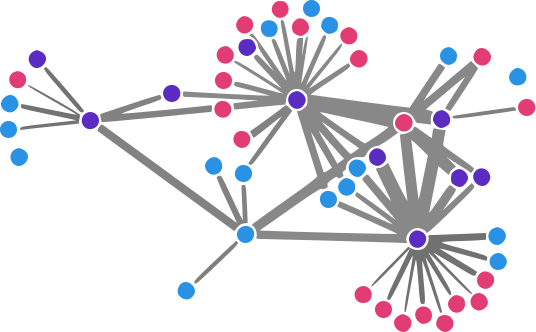
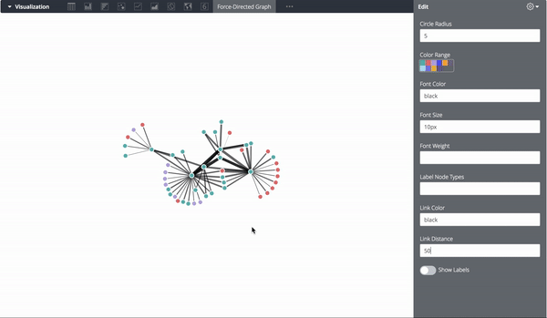

# Force-Directed Graph

Use a force-directed graph to show relationships between entities in your data.

Nodes within the graph are mathematically clustered together based-on their relationship with other nodes. The weight of the link (line between nodes) is based on the magnitude of the relationship.

Force-directed graphs are particularly effective for visualizing how various entities (dimensions) are connected to each other.

This diagram requires exactly 4 dimensions and 1 measure. It was built using the D3 visualization library.

* **Dimension 1**: node value 1
* **Dimension 2**: node value 1 group
* **Dimension 3**: node value 2
* **Dimension 3**: node value 2 group
* **Measure 1**: value of relationship

The example below depicts all bike share stations in the Boston areas. When riders bike from one station to another it creates a link in the data. The colors represent the city where the bike station is located (Boston, Cambridge, Somerville).  The four dimensions returned in this example are:

* Departing station (dimension)
* Departing station city (dimension)
* Arriving station (dimension)
* Arriving station city (dimension)
* Total bike trips (measure)




#### Building

1.  **Install Dependecies.**

    Using yarn, install all dependencies
    ```
    yarn
    ```
2. **Make changes to the source code**

3.  **Compile your code**
    ```
    yarn build
    ```