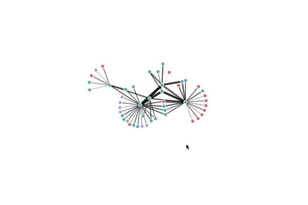
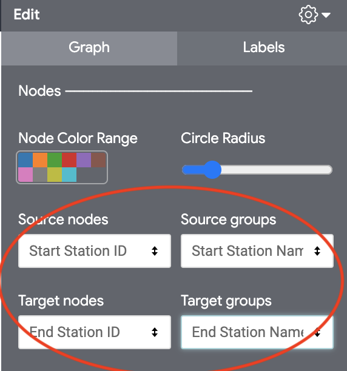
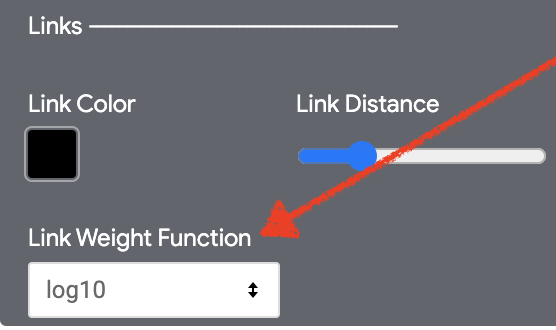
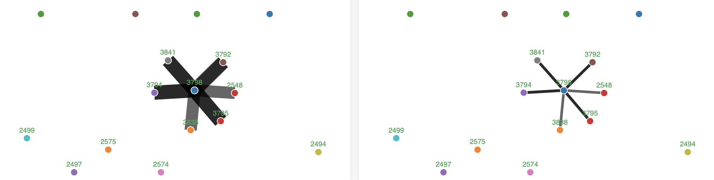
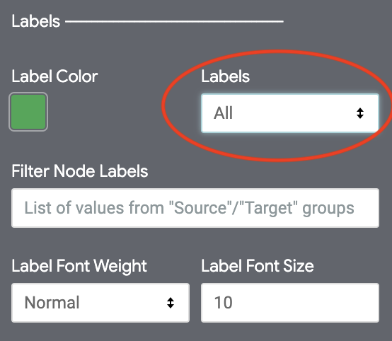
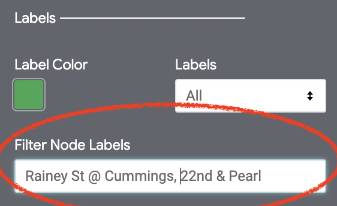
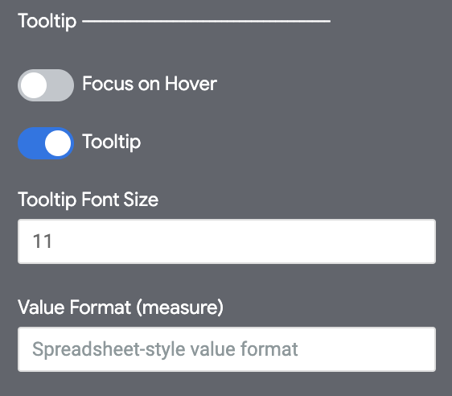
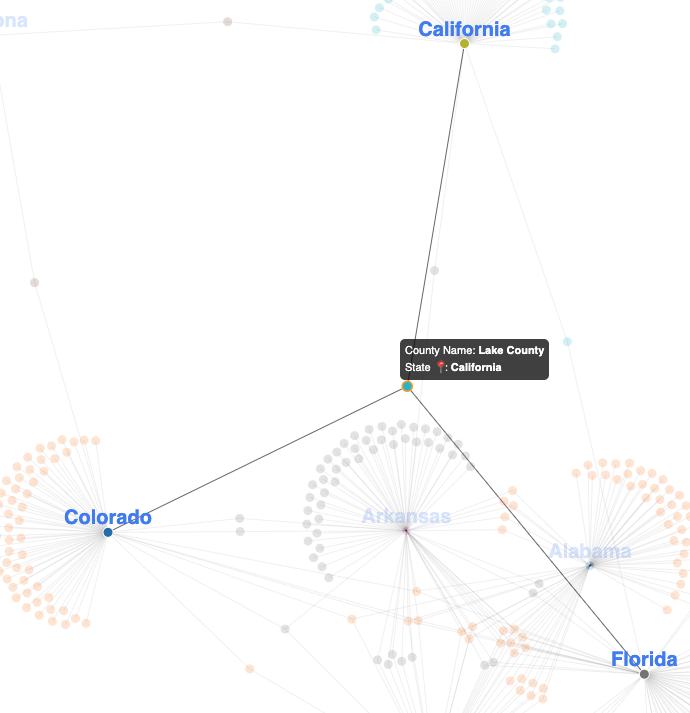

# Force-Directed Graph by [Hashpath](https://www.hashpath.com/)

### Originally created for Looker's Marketplace by [Hashpath](https://www.hashpath.com/)

Use a force-directed graph to show relationships between entities in your data.

Nodes within the graph are mathematically clustered together based-on their relationship with other nodes. The weight of the link (line between nodes) is based on the magnitude of the relationship.

Force-directed graphs are particularly effective for visualizing how various entities (dimensions) are connected to each other.

This diagram requires 4 dimensions and 0-1 measures. It was built using the D3 visualization library.

The example below depicts all bike share stations in the Boston areas. When riders bike from one station to another it creates a link in the data. The colors represent the city where the bike station is located (Boston, Cambridge, Somerville). The four dimensions returned in this example are:

- Departing station id (dimension)
- Departing station city (dimension)
- Arriving station id (dimension)
- Arriving station city (dimension)
- Total bike trips (measure)



## User Guide

### Choosing nodes and groups 
This visualization requires 4 dimensions. Each dimension is either a "source node", "source group", "target node", or "target group". "nodes" will determine what nodes are rendered while "groups" determine the color of each node. You can change what each dimension represents by using the selectors in the "Graph" section of the config panel:



- Source nodes
    - Unique values from this dimension are represented as starting nodes in the graph. For example, if plotting bicycle trip data, this would be the ID of the starting station. 

- Source groups
    - Unique values from this dimension will be used to color each source node by the category they map to. In general, this dimension should consist of categories by which target nodes may be grouped by. Continuing our example of bicycle trip data, this would be the city where each starting station is located.

- Target nodes
    - Unique values from this dimension will be used to determine the target node for each respective source node. A link (aka edge) is drawn from each source node to its respective target node to form the graph. In our example, this would be the end station id for each bicycle trip. 

- Target groups
    - Unique values from this dimension will be used to color each source node by the category they map to. As with "source groups", this dimension should consist categories by which target nodes may be grouped by. In our example, this would be the end city for each bicycle trip.

### Links 
If a measure is included in the query it will be used to determine the stroke width (weight) of the link between each node. However, some values may create links that are too wide. The "Link Weight Function" selector in the "Graph" section of the config panel provides several functions by which to normalize measure values to help prevent this. 



For example, the image on the left is using the "Cube Root" function while the right image is using "log10":


### Labels
Labels can be applied to nodes in two ways. 

- Label Selector
    - The label selector in the "Labels" section of the config panel allows for auto labeling of nodes by "Source Group", "Target Group", "All", or "On Hover". 
    - "Source Group" and "Target Group" will apply node labels to either "source nodes" or "target nodes". 
    - "All", will apply labels to every node.
    - "On Hover" appends labels to a node currently being hovered over and it's immediate neighbors (i.e. the node hovered over + all directly connected nodes). 



- Filter Label Nodes 
    - This text box takes a comma seperated list of values from either the "source groups" or "target groups" dimensions. This allows for node labeling by specific categories to help highlight nodes of interest. For example, in the image below only nodes from either the source or target groups "Rainey St @ Cummings" and "22nd & Pearl" will have labels:



### Tooltip 
The visualization includes a tooltip which can be toggled on or off. The content of the tooltip differs when hovering over a link and edge. 




Additionally, there is an option to "Focus on Hover" which will highlight the hovered node and it's immediate neighbors when toggled on. For Example: 




### Interested in extending the visualization for your own use case?

#### Quickstart Dev Instructions

1.  **Install Dependecies.**

    Using yarn, install all dependencies

    ```
    yarn install
    ```

2.  **Make changes to the source code**

3.  **Compile your code**

    You need to bundle your code, let's run:

    ```
    yarn build
    ```

    Recommended: Webpack can detect changes and build automatically

    ```
    yarn watch
    ```

    Your compiled code can be found in this directory.

**`./force-directed.js`**: This visualization's minified distribution file.

**`manifest.lkml`**: Looker's external dependencies configuration file. The visualization object is defined here.

**`marketplace.json`**: A JSON file containing information the marketplace installer uses to set up this project.

**`/src`**: This directory will contain all of the visualization's source code.

**`/src/force-directed.ts`**: The main source code for the visualization.
